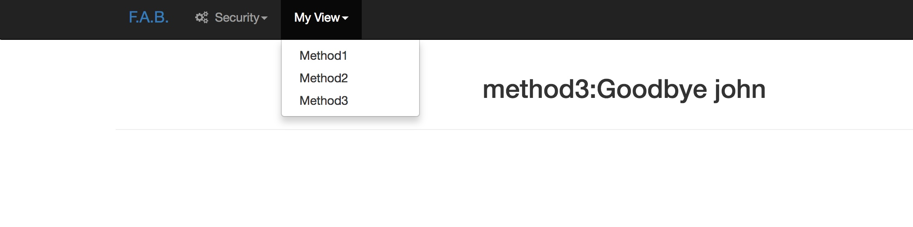
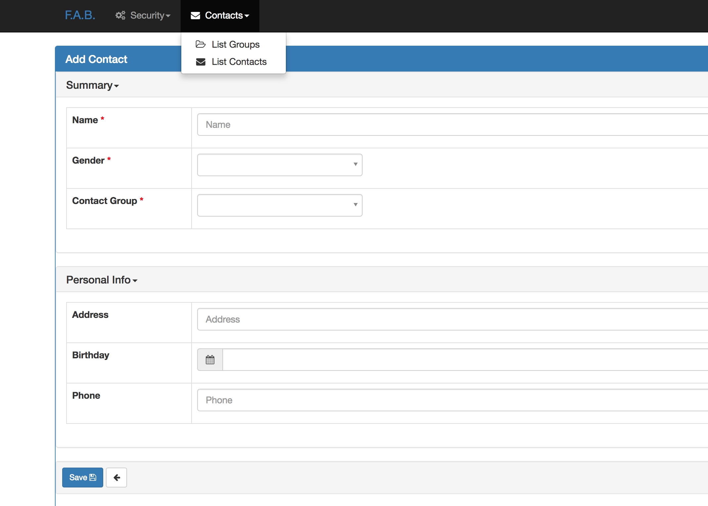

# FAB   1-Start

> [官方文档](http://flask-appbuilder.readthedocs.io/en/latest/)

### try

```shell
## 安装
➜  FlaskAppBuilder git:(master) ✗ source activate Python27
(Python27) ➜  FlaskAppBuilder git:(master) ✗ pip install flask-appbuilder

## 第一次尝试
(Python27) ➜  test git:(master) ✗ fabmanager create-app
Your new app name: test
Your engine type, SQLAlchemy or MongoEngine [SQLAlchemy]:
Downloaded the skeleton app, good coding!
(Python27) ➜  test git:(master) ✗ fabmanager create-admin
Username [admin]:xxx
User first name [admin]:xxx
User last name [user]:xxx
Email [admin@fab.org]: xxx@gmail.com
Password:
Repeat for confirmation:
....

(Python27) ➜  test git:(master) ✗ fabmanager run
....

## 打开 127.0.0.1:8080 即可看到开始页面
## 说实话我直接安装下来
## 看代码感觉问题还是挺多的
```

### Command Line Manager

列几个常用的

```shell
create-app      # 创建你的APP
create-admin    # 创建管理员
create-db       # 创建数据库对象(SQLAlchemy)
list-users      # 显示所有用户
list-views      # 显示所有views
reset-password  # 重置密码
run             # 运行
upgrade-db      # FAB升级后升级数据库
version         # FAB的版本
```

### Base Configuration

```python
## config.py
app = Flask(__name__)
app.config.from_object('config')
```

### Base Views

*You can use this kind of view to implement your own custom pages, attach it to a menu or link it from any point to your site.*

*@expose -- Decorate your url routing methods.*

*@has_access -- to tell flask that this is a security protected method.*


[sampleView1](https://github.com/dpgaspar/Flask-AppBuilder/tree/master/examples/simpleview1)


```python
## views.py
from flask_appbuilder.baseviews import BaseView
from flask_appbuilder.baseviews import expose
from . import appbuilder

class MyView(BaseView):
    route_base = "/myview"

    @expose('/method1/<string:param1>')
    def method1(self, param1):
        param1 = 'Hello %s' % (param1)
        return param1

    @expose('/method2/<string:param1>')
    def method2(self, param1):
        param1 = 'Goodbye %s' % (param1)
        return param1

appbuilder.add_view_no_menu(MyView())
## 打开http://127.0.0.1:8080/myview/method1/2222
## 会看到 hello 2222...

## 打开http://127.0.0.1:8080/myview/method2/3333
## 会看到
```


[sampleView2](https://github.com/dpgaspar/Flask-AppBuilder/blob/master/examples/simpleview2/app/views.py)

```python
## views.py
from flask_appbuilder import BaseView, expose, has_access
from . import appbuilder


class MyView(BaseView):

    default_view = 'method1'

    @expose('/method1/')
    @has_access
    def method1(self):
        return 'Hello'

    @expose('/method2/<string:param1>')
    @has_access
    def method2(self, param1):
        param1 = 'Goodbye %s' % param1
        return param1

    @expose('/method3/<string:param1>')
    @has_access
    def method3(self, param1):
        param1 = 'Goodbye %s' % (param1)
        self.update_redirect()
        return self.render_template('method3.html',param1 = param1)


appbuilder.add_view(MyView, "Method1", category='My View')
appbuilder.add_link("Method2", href='/myview/method2/john', category='My View')
appbuilder.add_link("Method3", href='/myview/method3/john', category='My View')


## /app/templates/method3.html


<h2><center>{{param1}}</center></h2>

```




### Model Views (Quick How to)

*a very simple contacts application*

*要知道SQLAlchemy*

[Quick How to](https://github.com/dpgaspar/Flask-AppBuilder/tree/master/examples/quickhowto)

Models定义表：
  - 联系人，姓名/生日/地址/电话/性别/联系人分组
  - 联系人分组，对联系人进行分类
  - 性别

```python
# coding=utf-8
from sqlalchemy import Column, Integer, String, ForeignKey, Date
from sqlalchemy.orm import relationship
from flask_appbuilder import Model


class ContactGroup(Model):
    """
    联系人分组
    """
    id = Column(Integer, primary_key=True)
    name = Column(String(128), unique=True, nullable=False)

    def __repr__(self):
        return self.name


class Gender(Model):
    """
    性别
    """
    id = Column(Integer, primary_key=True)
    name = Column(String(128), unique=True, nullable=False)

    def __repr__(self):
        return self.name


class Contact(Model):
    """
    联系人 id/姓名/地址/生日/电话/联系人分组/性别
    """
    id = Column(Integer, primary_key=True)
    name = Column(String(128), unique=True, nullable=False)
    address = Column(String(512))
    birthday = Column(Date, nullable=True)
    personal_phone = Column(String(32))
    contact_group_id = Column(
        Integer,
        ForeignKey('contact_group.id'),
        nullable=False)
    contact_group = relationship("ContactGroup")
    gender_id = Column(Integer, ForeignKey('gender.id'), nullable=False)
    gender = relationship("Gender")

    def __repr__(self):
        return self.name
```


现在我们来看 views

```python
# coding=utf-8
from flask_appbuilder import ModelView
from flask_appbuilder.models.sqla.interface import SQLAInterface

from . import db, appbuilder
from .models import ContactGroup, Contact


class ContactModelView(ModelView):
    datamodel = SQLAInterface(Contact)
    # datamodel:is the db abstraction layer. Initialize it with your view’s
    # model.

    list_columns = ['name', 'phone', 'birthday', 'contact_group.name']
    base_order = ('name', 'asc')

    # A fieldset. You can use show_fieldsets, add_fieldsets, edit_fieldsets customize the show,
    # add and edit views independently.
    show_fieldsets = [
        ('Summary', {'fields': ['name', 'gender', 'contact_group']}),
        ('Personal Info', {'fields': ['address', 'birthday', 'phone'], 'expanded': False}), ]

    add_fieldsets = [
        ('Summary', {'fields': ['name', 'gender', 'contact_group']}),
        ('Personal Info', {'fields': ['address', 'birthday', 'phone'], 'expanded': False}), ]

    edit_fieldsets = [
        ('Summary', {'fields': ['name', 'gender', 'contact_group']}),
        ('Personal Info', {'fields': ['address', 'birthday', 'phone'], 'expanded': False}), ]


class GroupModelView(ModelView):
    datamodel = SQLAInterface(ContactGroup)
    related_views = [ContactModelView]
    # related_views:if you want a master/detail view on the show and edit.
    # F.A.B. will relate 1/N relations automatically,
    # it will display a show or edit view with tab (or accordion) with a list
    # related record.


db.create_all()
appbuilder.add_view(
    GroupModelView,
    "List Groups",
    icon="fa-folder-open-o",
    category="Contacts",
    category_icon='fa-envelope')
appbuilder.add_view(
    ContactModelView,
    "List Contacts",
    icon="fa-envelope",
    category="Contacts")
```


效果很牛逼....




再完善......


